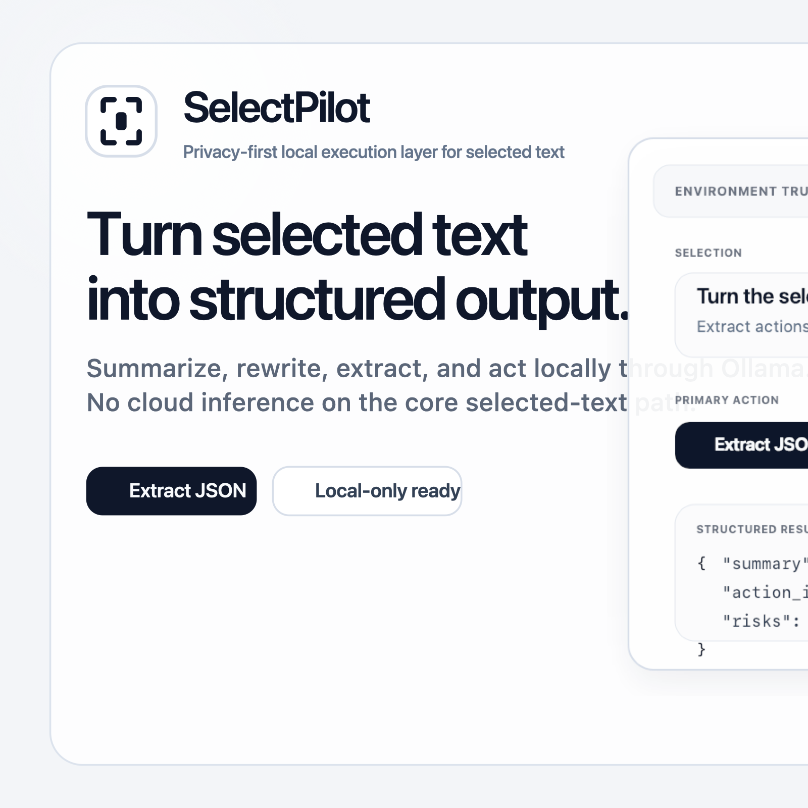
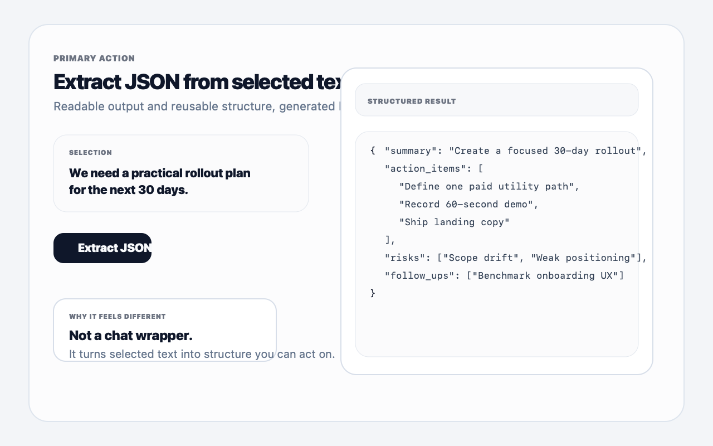
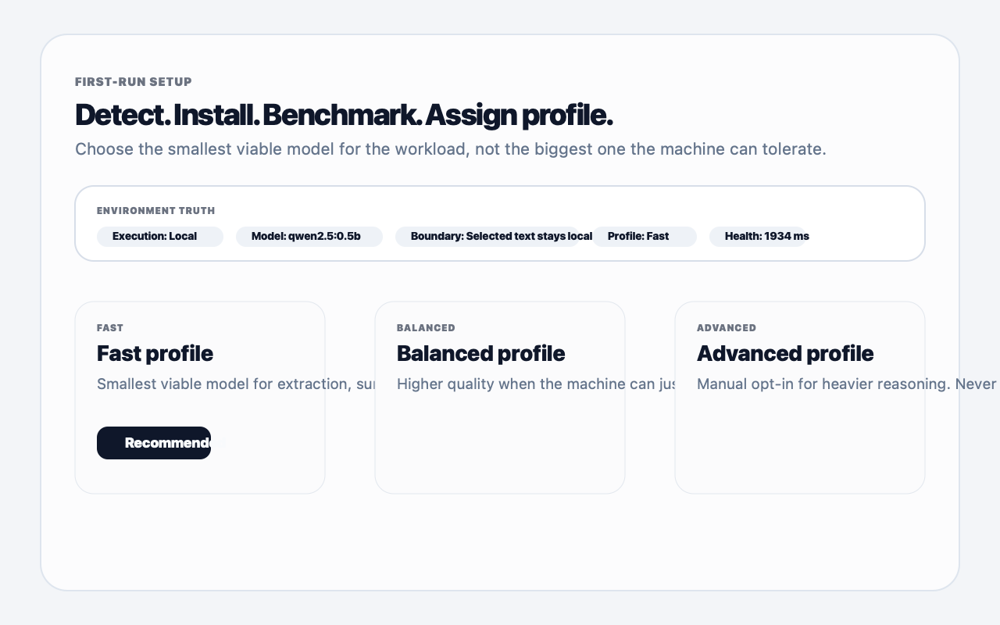
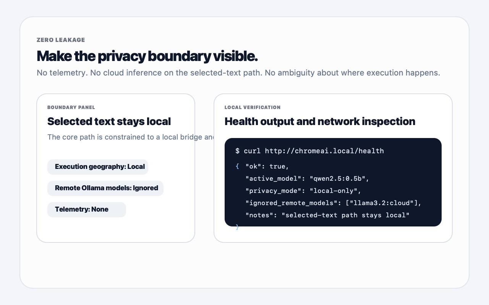

# SelectPilot



SelectPilot is a privacy-first local execution layer for selected text. Highlight something on the web, open the side panel, and turn that selection into structured output, summaries, rewrites, or prompted answers using Ollama running on your machine.

This is still an MVP, but the core loop is real and intentionally constrained: selected text is captured in the extension, routed through a local Python bridge, sent to a local Ollama model, and rendered back in a Chrome side panel without sending the selected-text path to hosted inference.

The recommended first-run flow is profile-based:

- `Fast`: smallest viable local model for extraction and short transforms
- `Balanced`: better quality when the machine can handle it
- `Advanced`: manual opt-in for heavier local models

The setup flow is `Detect -> Install -> Benchmark -> Assign profile`, with the smallest viable model chosen for the selected-text workload rather than the largest model the machine can tolerate.

For the privacy boundary and verification checklist, see [ZERO_LEAKAGE.md](./ZERO_LEAKAGE.md).
For a fast application-ready walkthrough, see [DEMO_SCRIPT.md](./DEMO_SCRIPT.md).

## Product visuals

<p align="center">
  
</p>
<p align="center">
  <strong>Structured extraction</strong><br>
  Turn selected text into reusable JSON instead of another blob of generated prose.
</p>

<table>
  <tr>
    <td width="50%" valign="top">
      
      <br><br>
      <strong>Runtime setup</strong><br>
      Detect the local runtime, benchmark the workload, and choose the smallest viable model profile.
    </td>
    <td width="50%" valign="top">
      
      <br><br>
      <strong>Privacy boundary</strong><br>
      Make the local-only execution path visible through the environment truth strip and health output.
    </td>
  </tr>
</table>

## Why this exists

Most browser AI tools are thin wrappers around remote APIs. SelectPilot is built around a narrower promise:

- Privacy first: the core selected-text path stays local by design.
- Zero leakage on the main workflow: selected text is not sent to cloud-hosted Ollama models.
- Useful before broad: summarize, rewrite, and extract structured output from highlighted text quickly.

## Privacy-first promise

- `Extract JSON`, `Summarize`, `Ask`, and `Embed` run through a local bridge and local Ollama models.
- Cloud Ollama models are explicitly ignored for the core selected-text path.
- No telemetry or analytics are part of the runtime flow.
- The privacy boundary is visible and testable through the `/health` endpoint and DevTools network inspection.

## What it does

- Extracts reusable JSON from selected text with preset schemas such as Action Brief, Generic JSON, Job Brief, and Decision Log.
- Summarizes selected text or page content from the active tab via Ollama.
- Rewrites or transforms selected text with prompted local model calls.
- Extracts action items and next steps from highlighted content.
- Runs an agent-style workflow from the side panel with a user-editable prompt.
- Stores license data locally and gates features by tier.
- Enforces a local-only boundary for summarize, agent, and embed by ignoring Ollama cloud models.
- Includes a local Python service, launchd wiring, and nginx proxy config for `http://chromeai.local`.
- Keeps audio and vision flows as explicit experimental tools, not the main product promise.

## Project status

- Chrome extension shell: implemented
- Side panel UI: implemented
- Content capture: implemented
- Local service layer: implemented
- Ollama integration for summarize/agent/embed: implemented
- Tiering and pricing model: implemented
- Billing and license verification flows: prototype
- Audio and vision tools: prototype

## Repo layout

- `manifest.json`: MV3 extension manifest
- `background/`: service worker and tier gating
- `content/`: extraction helpers for text, audio, and video
- `panel/`: side panel UI
- `popup/`: popup action entrypoint
- `agent/`: agent prompt and reasoning pipeline
- `api/`: local service client
- `billing/`: Paddle checkout prototype
- `licensing/`: local license storage and verification
- `server/`: local Python service
- `launchd/`, `nginx/`: local macOS setup

## Local setup

### 1. Install dev dependencies

Preferred:

```bash
pnpm install
```

Fallback:

```bash
npm install
```

### 2. Build JavaScript from TypeScript

```bash
pnpm build
```

### 3. Bootstrap the local runtime

Recommended:

```bash
pnpm bootstrap:local
```

Explicit profile examples:

```bash
pnpm bootstrap:local -- --profile fast
pnpm bootstrap:local -- --profile balanced
pnpm bootstrap:local -- --profile advanced
```

The bootstrapper will:

- install Ollama with Homebrew if needed
- pull the selected generation and embedding models
- install the local LaunchAgent with the chosen profile
- recommend a follow-up benchmark

### 4. Add the local hostname

Add this line to `/etc/hosts` if it is missing:

```text
127.0.0.1 chromeai.local
```

### 5. Install the nginx config

```bash
sudo cp nginx/chromeai.conf /usr/local/etc/nginx/nginx.conf
sudo nginx -t
sudo nginx -s reload
```

### 6. Load the unpacked extension

Open `chrome://extensions`, enable Developer Mode, choose `Load unpacked`, and select this project root.

### 7. Make sure Ollama is running

Examples:

```bash
ollama serve
ollama list
ollama pull qwen2.5:0.5b
ollama pull nomic-embed-text-v2-moe:latest
```

### 8. Benchmark the profile

After the local bridge is installed, run the built-in benchmark:

```bash
pnpm benchmark:local
```

If the Fast profile is too slow on your machine, move up to Balanced. If the machine is powerful and you want better output, opt into Advanced manually.

## Validation

For a concise manual test checklist, see [VALIDATION_STEPS.md](./VALIDATION_STEPS.md).

You can also run the local service directly:

```bash
pnpm validate:server
```

And verify it responds:

```bash
curl http://127.0.0.1:8083/health
```

## Notes

- The local Python service now forwards summarize, agent, and embed requests to Ollama and surfaces health information for the configured model.
- The core privacy story is local-only for the selected-text path. Structured extraction requires an actual text selection, while summarize and ask can fall back to page text.
- See [ZERO_LEAKAGE.md](./ZERO_LEAKAGE.md) for the exact claim and how to verify it.
- Privacy-first is the product thesis, not a side feature.
- Runtime JavaScript is generated from the `.ts` sources with `pnpm build` or `npm run build`.
- The project is best presented as a focused selected-text MVP, not as a polished all-in-one browser assistant.
