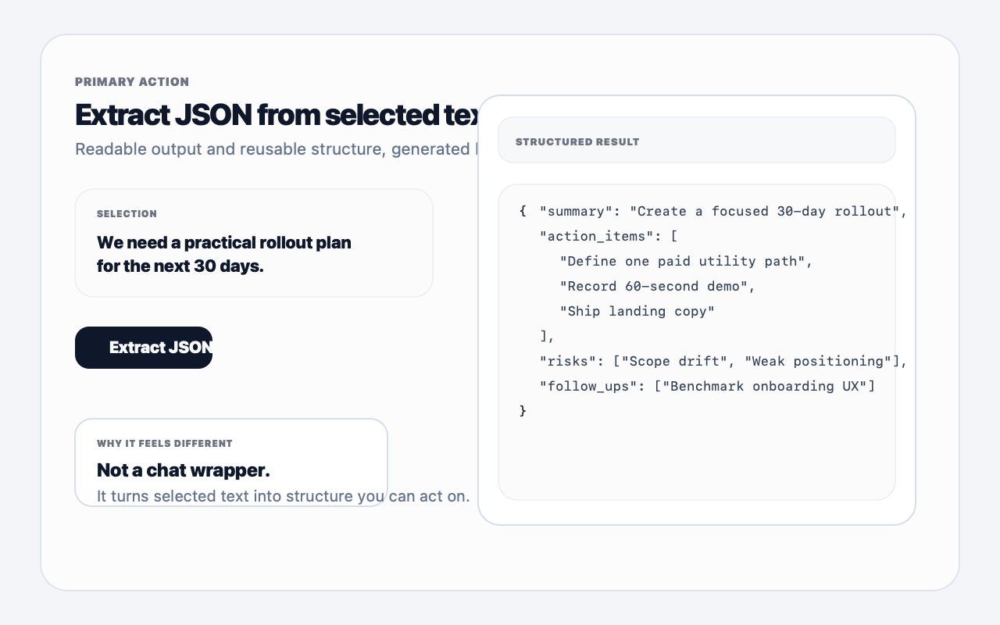
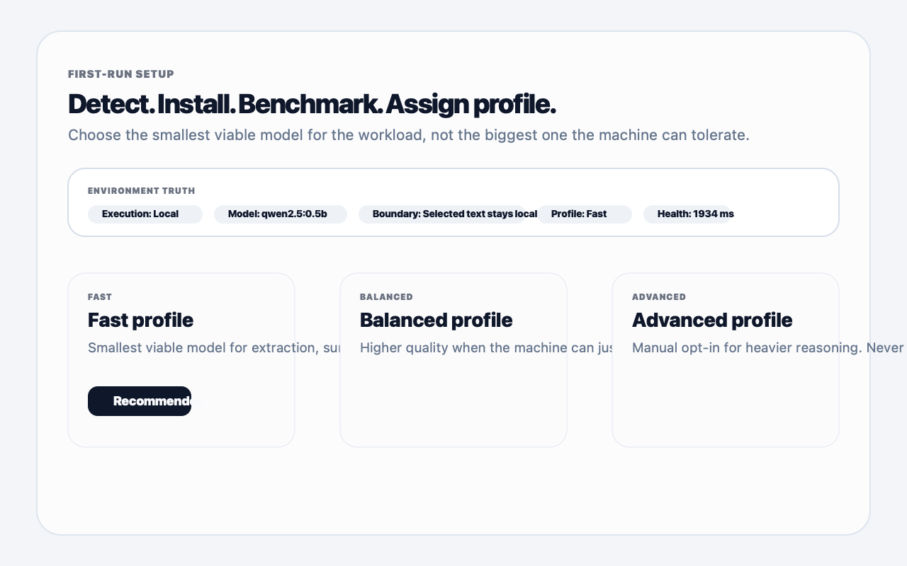
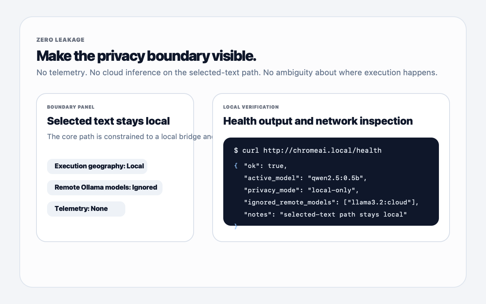

# SelectPilot

> **SelectPilot is not a prompt interface.**
> It is a **deterministic execution layer** that compiles user intent into controlled, contract-bound operations over local models.

Local AI in your browser.
No data leaves your device on the core selected-text path.

Select text on any page → extract structured knowledge → export where it belongs.

Runs on local models via Ollama.





---

## Why SelectPilot

Most browser AI tools send your context to external APIs.

SelectPilot is built to keep the core workflow local-first and inspectable.

- No outbound cloud inference on the core selected-text workflow
- No telemetry in runtime flow
- No API keys required for core usage
- Deterministic local boundary (`127.0.0.1` bridge + local Ollama)

---

## What it does

- Extracts structured knowledge from selected text
- Generates canonical metadata (source, intent, timestamps)
- Exports to adapter targets (e.g. Obsidian/Notion package formats)
- Uses profile-based local runtime selection (Fast / Balanced / Advanced)
- Uses editable, closed-schema extraction presets from `presets/extraction-presets.json`

---

## Quick Start

1. From the repository folder, run the one-command setup:

```bash
pnpm setup:local
```

This installs dependencies, builds the extension, installs/starts Ollama when needed, selects a hardware-safe local profile, pulls the exact models, installs the LaunchAgent, and refuses to finish unless the bridge and both configured models are healthy.

2. Open `chrome://extensions`, enable **Developer mode**, choose **Load unpacked**, and select this repository folder.
3. Highlight text on a page → open SelectPilot → click **Extract JSON**.

Optional local checks:

```bash
curl http://127.0.0.1:8083/health
pnpm test:privacy
```

If setup stops, no fallback was applied. Copy/paste these diagnostics:

```bash
tail -n 80 ~/Library/Logs/SelectPilot/nano.err
tail -n 80 ~/Library/Logs/SelectPilot/nano.log
curl -sSf http://127.0.0.1:8083/health
```

---

## Architecture

Browser Extension (UI)
        ↓
Local Bridge (`127.0.0.1:8083`)
        ↓
Python Backend (`server/`)
        ↓
Ollama (local models)

- All core inference runs locally
- No external inference endpoints on core path
- Privacy boundary is observable and testable

Runtime authority and candidate-lane promotion rules are defined in [`docs/AI_RUNTIME_LANE_MATRIX.md`](docs/AI_RUNTIME_LANE_MATRIX.md).

---

## Privacy Model

- Core selected-text processing happens locally
- No outbound requests for core inference
- No tracking or telemetry in runtime flow
- Verified with privacy and E2E tests (`tests/`)

See: `ZERO_LEAKAGE.md`

---

## Core Concepts

### Canonical schema
All extracted data is normalized before export.

### Connectors (adapters)
Exports are mapped to target formats without lock-in.

### Local-first execution
Your hardware and selected profile determine latency/quality.

---

## Tiers

The repository configuration is authoritative for price and entitlement mapping:

| Tier | Price | Product boundary |
| --- | ---: | --- |
| Essential | $1.99 | Local structured extraction, canonical metadata and manual copy/export |
| Plus | $5.99 | Essential plus stateless summaries, batch clipping and connector-format exports |
| Pro | $14.99 | Plus plus multimodal processing and an explicit opt-in local knowledge layer |

Essential and Plus do not retain a knowledge history. Pro stateful features must remain local, visible and user-controlled: retained data can be inspected, exported and deleted. A feature is available only when the signed entitlement and `pricing/tier-feature-map.json` both permit it; there is no silent downgrade or fallback.

Displayed tier prices live in `pricing/pricing-global.json`. Checkout is not embedded in the extension: paid tokens come from the separately operated local entitlement authority, and Store packaging excludes inactive remote-checkout code and product placeholders.

### Team / self-hosted

Team/self-hosted mode is planned, not shipped. Its admission contract requires an operator-owned Ollama endpoint, zero-access encrypted synchronization where synchronization is enabled, explicit tenant and retention controls, auditable entitlement administration, and the same no-cloud-fallback rule as the individual product. Until those paths pass real deployment, privacy, failure/recovery and multi-user isolation tests, SelectPilot makes no Team or self-hosted availability claim.

---

## Project Structure

- `panel/` — side panel UI and interaction flow
- `background/` — extension runtime + feature gating
- `server/` — local Python bridge and runtime endpoints
- `api/` — extension-to-local-bridge client layer
- `tests/` — E2E + privacy/no-leakage tests
- `presets/` — canonical editable extraction preset registry ([format](docs/extraction-presets.md))

---

## What SelectPilot is

- Deterministic intent-to-operation compiler for selected text workflows
- Contract-bound local execution layer over Ollama-hosted models
- Structured extraction + canonical output + adapter-based export pipeline

## What SelectPilot is not

- Cloud AI wrapper
- Generic prompt/chat interface
- Telemetry-driven data-harvesting tool

---

## Status

Active development.
Core local pipeline is functional and test-backed.
Current focus: protected-main admission and physical Apple-hardware runtime verification. Team/self-hosted mode remains planned.

---

## Repository

https://github.com/kristoffersodersten/selectpilot

---

## Repository Governance (Phase 1)

SelectPilot uses PR-first and status-check-first repository controls to keep code-state deterministic.

### Branch protection (main)

Enable these settings on `main`:

- Require a pull request before merging
- Require status checks to pass before merging
- Require linear history
- Do not allow force pushes
- Do not allow branch deletion

### Required checks

Mark these as required in branch protection:

- `CI / validate (20.x)`
- `CI / validate (22.x)`
- `Dependency Review / dependency-review`
- `CodeQL / Analyze (javascript-typescript)`
- `CodeQL / Analyze (python)`

### CI coverage

Current CI enforces:

- lint (`pnpm lint`, `pnpm lint:manifest`)
- typecheck (`pnpm typecheck`)
- build (`pnpm build`)
- baseline tests (`pnpm test`)
- Chrome Web Store asset dimensions (`pnpm validate:store`)

## Chrome Web Store Release

Store listing copy, privacy language, and the release checklist live in:

- [`docs/CHROME_WEB_STORE_SUBMISSION.md`](docs/CHROME_WEB_STORE_SUBMISSION.md)
- [`docs/CHROME_WEB_STORE_RELEASE_CHECKLIST.md`](docs/CHROME_WEB_STORE_RELEASE_CHECKLIST.md)
- [`docs/PRIVACY_POLICY.md`](docs/PRIVACY_POLICY.md)

`pnpm package:store` builds and audits the upload ZIP. It intentionally fails closed until production entitlement signature verification is configured; no unsigned commercial package is release-eligible.

## Compute Distribution

This project follows the Mac Mini / Hetzner split documented in `docs/compute-distribution.md`.
Use VS Code Remote SSH for normal implementation and use GitHub Actions or Hetzner output as proof for heavy gates.
See `docs/operator-tooling.md` and `docs/remote-workspace.md` for the operator contract and remote workspace proof rules.
